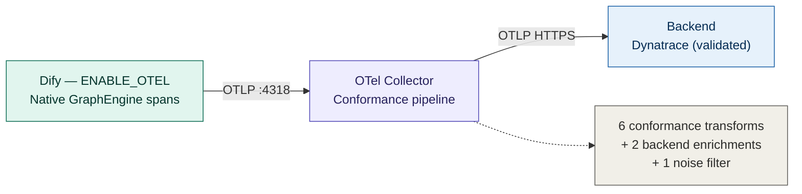

# Runbook — Dify → OpenTelemetry → Dynatrace Bridge

Operational guide for running the telemetry bridge (`dynatrace-otel-bridge`)
alongside a self-hosted Dify installation on a VM.

---

## Architecture overview

The bridge turns Dify's native (but non-conformant) OpenTelemetry output into
GenAI-semantic-convention-compliant telemetry and forwards it to an
observability backend. There is a single active telemetry path (**Track A**):



Dify emits node-level spans natively from the GraphEngine `ObservabilityLayer`,
covering every invocation path (Studio, WebApp, Service API, Debugger). The
Collector normalizes the native dialect to the official OTel GenAI Semantic
Conventions and forwards it to the backend over OTLP.

**Backend portability.** The receiver, the conformance processors, and the OTLP
transport are backend-agnostic by design — they emit standard OTel GenAI
telemetry that any conformant backend (Dynatrace, Datadog, Grafana, Honeycomb,
New Relic, …) can ingest. Only the exporter and two enrichment processors are
Dynatrace-specific (see [Telemetry pipeline](#telemetry-pipeline)). This bridge
is **validated against Dynatrace AI Observability**; other backends are
supported by design but not yet validated (see [Portability](#portability)).

> A former **Track B** — an SSE reverse-proxy/exporter on port 8088 — was
> retired once Track A was validated as a strict superset. It is archived under
> [`legacy/`](legacy/README.md).

---

## 1. Prerequisites

- A Linux VM (or host) that can run Docker + Docker Compose, reachable over SSH.
- A Dynatrace tenant (SaaS).
- A Dynatrace API Token with **ingest** scopes:
  - `openTelemetryTrace.ingest`
  - `metrics.ingest`
  - `logs.ingest`

  These are different from the `*.read` scopes used elsewhere; a read-only
  token will not work here.

> **Cloud provider.** This bridge was developed and tested on Google Cloud
> (GCE), and [GCP-SETUP.md](GCP-SETUP.md) documents that path end to end. GCP is
> **not** a prerequisite — the stack is plain Docker Compose and runs on any
> cloud (AWS EC2, Azure VM, …) or on-prem host. On other providers, replace the
> GCP-specific provisioning and firewall steps with your platform's equivalents;
> everything from step 3 onward is provider-agnostic.

## 2. Provisioning

For Google Cloud, see [GCP-SETUP.md](GCP-SETUP.md) for machine specs, firewall
rules, and Docker/Compose/git installation. On another provider, provision a
comparable VM and open the equivalent ports. Return here once the VM is
reachable over SSH and `docker compose version` works.

## 3. Deployment

This assumes the official Dify self-hosted installation is already present on
the VM (its `docker/` directory, with `docker-compose.yaml` and `.env`).

1. Clone/pull this repo onto the VM.

2. Configure and start the Collector first — the shared Docker network
   (`dify-otel-net`) that Dify's `api`/`worker` depend on is created by this
   stack, so it must come up before Dify's `docker compose up`:

   ```bash
   cd examples/docker-compose
   cp .env.example .env
   #   edit .env: DT_OTLP_ENDPOINT, DT_API_TOKEN (+ optional DEPLOYMENT_ENVIRONMENT)
   docker compose up -d
   ```

3. Apply the Dify override. Copy this repo's
   [docker-compose.override.dify-example.yaml](docker-compose.override.dify-example.yaml)
   into the Dify installation's `docker/` directory, renaming it:

   ```bash
   cp docker-compose.override.dify-example.yaml <dify-install>/docker/docker-compose.override.yaml
   ```

4. Bring up (or restart) the Dify stack so the override is applied:

   ```bash
   cd <dify-install>/docker
   docker compose up -d
   ```

   Node-level telemetry is now emitted natively by Dify once the override points
   it at `otel-collector:4318`. No extra service is required.

## 4. Verification

Run these from the VM after step 3.

**Dify is up:**
```bash
cd <dify-install>/docker
docker compose ps
```
All services should show `Up` (or `running`/`healthy`, depending on Compose version).

**`web` binds on all interfaces (0.0.0.0:3000), not a single network's IP:**
```bash
docker compose exec web sh -c "ss -ltnp 2>/dev/null || netstat -ltnp 2>/dev/null" | grep 3000
```
Expect `0.0.0.0:3000` (or `:::3000`) — not a specific container IP.

**`api` resolves `otel-collector` by DNS name (shared `dify-otel-net`):**
```bash
docker compose exec api getent hosts otel-collector
```
Expect an IP. If `getent` isn't in the image, use:
```bash
docker compose exec api python -c "import socket; print(socket.gethostbyname('otel-collector'))"
```

**Collector is healthy:**
```bash
cd <path-to-this-repo>/examples/docker-compose
curl -sf http://localhost:13133 && echo " OK"
```

**Collector is exporting without errors:**
```bash
docker compose logs --tail 100 otel-collector | grep -i "Exporting failed"
```
No output = no export failures. If this prints lines, see [Troubleshooting](#6-troubleshooting).

**Node-level telemetry is flowing:**
Run any Dify workflow (Studio, WebApp, or API), then confirm node-level spans
from `langgenius/dify` arrive in the backend. In Dynatrace, use the AI
Observability app or a DQL query:
```
fetch spans
| filter service.name == "langgenius/dify"
| filter isNotNull(gen_ai.request.model)
| fields span.name, gen_ai.request.model, gen_ai.response.model, gen_ai.provider.name
| limit 10
```
Expect the model (`gen_ai.request.model` / `gen_ai.response.model`) and a clean
provider name (`gen_ai.provider.name`). No exporter is involved — Dify emits
these natively; the Collector normalizes them.

---

## Telemetry pipeline

The traces pipeline applies, in order: `resource` → one noise filter → seven
conformance/enrichment transforms → `batch`. Processors are grouped below by
portability.

### Backend-agnostic (OTel GenAI Semantic Convention conformance)

These correct Dify's native dialect to the official conventions and benefit
**any** OTel backend.

| Processor | Native Dify gap | Effect |
|---|---|---|
| `filter/drop_dify_console_noise` | Dify's HTTP auto-instrumentation emits server spans for **all** routes (`/console/api/*`, `/health`, `/openapi.json`, `.env` scanner traffic). These carry no GenAI signal but inflate error/invocation counts and ingest volume. | Drops spans that have an HTTP method **and** no `gen_ai.request.model` **and** no `dify.workflow_id`. Triple guard preserves the workflow-root span (which has an HTTP method but carries `dify.workflow_id`) and every LLM node. Dropped spans are leaves, so traces are not orphaned. |
| `transform/genai_finish_reasons` | Dify emits `gen_ai.response.finish_reason` (singular string); the convention defines `gen_ai.response.finish_reasons` (array). | Moves the value into the array attribute and removes the singular key. Conforms to OTel GenAI Semantic Conventions v1.37. |
| `transform/genai_dify_namespace_cleanup` | Four Dify-specific attributes are emitted under the `gen_ai.*` namespace but are not part of the convention (`gen_ai.span.kind`, `gen_ai.framework`, `gen_ai.user.id`, TTFT). | Relocates them to a `dify.*` namespace and removes the originals, keeping `gen_ai.*` convention-pure. |
| `transform/genai_legacy_promotion` | Dify emits legacy `gen_ai.prompt` / `gen_ai.completion` and Arize/OpenInference `input.value` / `output.value`. | Promotes the legacy pair to `gen_ai.input.messages` / `gen_ai.output.messages` when the modern form is absent (delete-after-set avoids duplication). Preserves `input.value` / `output.value` under their own namespace — a distinct "chain I/O" concept, not merged. |
| `transform/genai_tool_retrieval_namespace` | Dify emits `gen_ai.tool.call.result` / `gen_ai.tool.type` (outside the official `gen_ai.tool.*` set) and `retrieval.query` / `retrieval.document` (no stable `gen_ai.retrieval.*` in spec yet). | Relocates the non-official attributes to a `dify.*` namespace; keeps the convention-compliant `gen_ai.tool.*` attributes as-is. |
| `transform/genai_provider_name_normalize` | For plugin-installed providers, Dify emits the raw `model_provider` as `{org}/{plugin}/{provider}` (e.g. `langgenius/groq/groq`). The convention and most backends expect a clean name (`groq`). | Collapses to the last path segment (strips everything up to the last slash). Already-clean values are unchanged. |

### Backend-specific (Dynatrace AI Observability enrichment)

These are conformant with the OTel spec, but their **motivation** is a Dynatrace
AI Observability requirement discovered by inspecting the app's internal tile
queries. On another backend they may be unnecessary or need adaptation.

| Processor | Native Dify gap | Dynatrace-specific rationale |
|---|---|---|
| `transform/genai_operation_name` | Dify defines but never emits `gen_ai.operation.name`. | The AI Observability app classifies a span as a model operation via `gen_ai.operation.name`. Set to `"chat"` (the spec's well-known value) when `gen_ai.request.model` exists and the field is unset. Also improves conformance generally. |
| `transform/genai_response_model` | Dify emits only `gen_ai.request.model`; `gen_ai.response.model` is never set. | The AI Observability "Number of models" tile counts via `countDistinct(gen_ai.response.model)`; without this field it reads 0. Copies request → response (valid because Dify performs no model routing/fallback/aliasing — the two are identical by construction). |

---

## Portability

The bridge is backend-agnostic by design and **validated against Dynatrace AI
Observability**. To target another backend:

1. **Replace the exporter.** Swap `otlphttp/dynatrace` (and the traces/metrics/
   logs pipeline `exporters:`) for your backend's OTLP endpoint and auth. The
   `resource`, `filter`, and conformance transforms are unchanged.
2. **Review the two backend-specific processors.** `genai_operation_name` and
   `genai_response_model` were motivated by Dynatrace tile queries. They remain
   spec-conformant, but another backend may count models/operations from
   different attributes — verify against that backend's LLM/GenAI app before
   relying on them.
3. **Account for backend-side normalization.** Some backends normalize
   attributes after ingestion (e.g. Dynatrace's Grail rewrites `http.method` →
   `http.request.method` post-Collector). The Collector only ever sees the raw
   attribute; do not assume the backend-displayed name is what the pipeline
   operates on.

> **TODO (roadmap):** validate the backend-agnostic path against Datadog LLM
> Observability and Grafana/Tempo. Until then, non-Dynatrace backends are
> supported *by design* but untested.

---

## Operational notes

Field-tested considerations specific to this stack.

**Collector config changes require a restart, not a rebuild.**
The Collector consumes its configuration through a bind-mounted file. Apply a
config change with
`docker compose -f examples/docker-compose/docker-compose.yaml restart otel-collector` —
no image rebuild. (This differs from services built from a local `Dockerfile`,
which require `up -d --build`.)

**The Collector image is distroless.**
`dynatrace/dynatrace-otel-collector` has no shell and no `cat`. Inspect the
running configuration from the host side (the bind-mounted file), not by
`exec`-ing into the container.

**Run the Collector via the correct Compose file.**
Use `examples/docker-compose/docker-compose.yaml`. A root-level
`docker-compose.yaml` may be an override fragment and is not a standalone entry
point.

**Native telemetry is emitted regardless of invocation source.**
Because instrumentation is at the GraphEngine level, Studio, WebApp, Service
API, and Debugger all produce Track A spans. There is no HTTP-route dependency;
any Dify workflow execution is captured.

**Git operations: the VM is pull-only.**
The VM has no write credentials to the remote. Run `push` / `push --delete`
from a workstation that is authenticated; on the VM use only `fetch` / `pull` /
`checkout`. A `push` from the VM will fail authentication.

**Moving a Compose file changes its derived project name.**
Docker Compose derives the project name from the Compose file's directory.
Relocating a Compose file (e.g. into `legacy/`) orphans containers created
under the old project name — Compose can no longer manage them. Remove such
containers directly by name (`docker rm <name>` / `docker rmi <image>`), or
remove the service *before* moving the file.

**Dify's Flask instrumentation emits the legacy HTTP dialect.**
Raw spans carry `http.method` (not `http.request.method`). What appears as
`http.request.method` in Dynatrace is Grail's post-ingestion normalization —
not the attribute the Collector sees. Filters and transforms that key on the
HTTP method must match `http.method` (this pipeline matches both dialects for
safety).

**Validating a drop filter from debug logs requires a representative sample.**
When confirming a filter via `service.telemetry.logs.level: debug`, ensure the
captured batch actually contains the targeted span type. A `match: false` in a
batch that never included the target span proves nothing — a time-biased sample
(e.g. only redis/db spans) will mislead. Confirm a real target span was present
and evaluated (`condition evaluation result ... "match": true`).

**Token metrics are derived from span attributes, not a dedicated metric.**
Dify OSS/CE emits no GenAI token metric — tokens exist only as span attributes
(`gen_ai.usage.*_tokens`). Dynatrace AI Observability derives token/cost tiles
from those attributes via DQL, so no token metric is required. The
`sumconnector` (which could rebuild such a metric) is **not** in the
`dynatrace/dynatrace-otel-collector` distribution; reintroducing a token metric
via the Collector would require a custom build (OCB).

**DQL: use `start_time` for spans, and `prefix: ""` on `lookup`.**
Span queries filter/sort on `start_time`, not `timestamp`. On DQL `lookup`
commands, set `prefix: ""` — otherwise joined fields gain a `lookup.` prefix and
read as null downstream.

---

## 6. Troubleshooting

For anything beyond verification (collector crash loops, health-check failures,
401/403/404 from the backend, no data arriving, etc.), follow
[docs/troubleshooting.md](docs/troubleshooting.md) — it covers these cases in
detail and isn't duplicated here.
